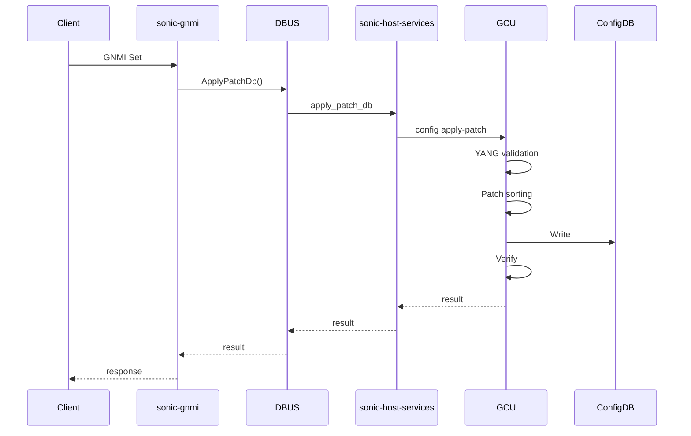
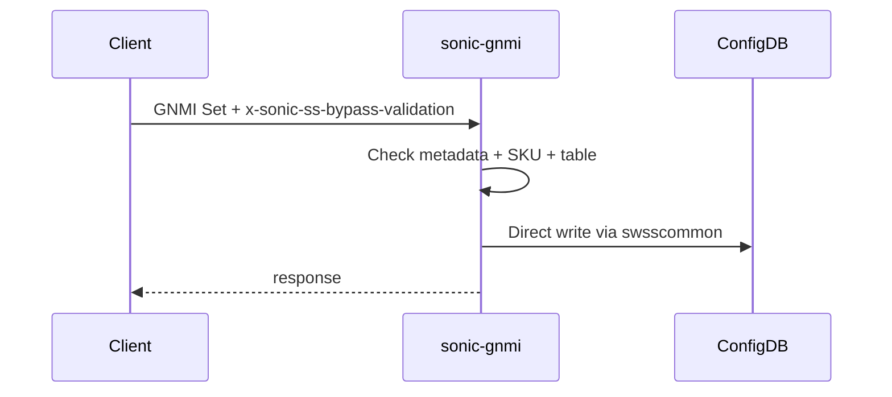

# GNMI Direct ConfigDB Write Bypass - Delivery Plan

## Overview
Bypass in sonic-gnmi to write directly to ConfigDB, skipping DBUS/GCU validation. Triggered per-request via gRPC metadata. For smartswitch platform. Reduces GNMI Set latency from ~6s to ~20ms.

## Timeline

| Date | Deliverable |
|------|-------------|
| 01/30 (Fri) | Implementation complete |
| 02/03 (Mon) | Docker image tar.gz delivered EOD |
| 02/04-07 | Handover to Anish, iterate on feedback |

---

## Current Flow (slow path ~6s)



## Bypass Flow (fast path ~20ms)



---

## Design

### Trigger Mechanism
Per-request gRPC metadata header (consistent with DPU proxy pattern):
```
x-sonic-ss-bypass-validation: true
```

Client usage:
```bash
gnmic set --metadata "x-sonic-ss-bypass-validation=true" ...
```

### Bypass Conditions (ALL must be true)
1. Metadata header `x-sonic-ss-bypass-validation=true` present
2. SKU matches target string (read from `DEVICE_METADATA|localhost`)
3. Target table in hardcoded allowlist

### Code Change Location
**File:** `sonic_data_client/mixed_db_client.go` (line ~1377)

Current:
```go
if c.origin == "sonic-db" {
    err = sc.ApplyPatchDb(string(text))  // DBUS → GCU (~6s)
}
```

With bypass:
```go
if c.origin == "sonic-db" {
    if shouldBypassValidation(ctx) && checkSKU() && isAllowedTable(table) {
        err = c.applyPatchDirectly(patchList)  // Direct ConfigDB (~20ms)
    } else {
        err = sc.ApplyPatchDb(string(text))    // Existing path
    }
}
```

### Metadata Extraction (following DPU proxy pattern)
```go
func shouldBypassValidation(ctx context.Context) bool {
    md, ok := metadata.FromIncomingContext(ctx)
    if !ok {
        return false
    }
    if values := md.Get("x-sonic-ss-bypass-validation"); len(values) > 0 {
        return values[0] == "true"
    }
    return false
}
```

---

## Risk Acknowledgment
- No YANG validation (invalid config possible)
- No dependency ordering
- Race conditions on concurrent writes
- Gated by metadata + SKU + table allowlist for safety
